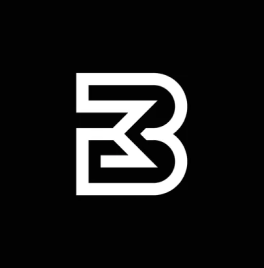

# Boundless Minds



## 🌟 About

Boundless Minds is an inclusive educational platform designed to make learning accessible for specially-abled communities. Our mission is to make society better by ensuring that educational opportunities are available to all students, regardless of their abilities or disabilities.

> "Limitations don't define us, our determination does."

## 🎯 Mission

We aim to address the exclusion problem resulting from inaccessible educational platforms that exclude an important portion of the student population. Many standardized educational websites do not cater to the varied demands of disabled students, thus limiting their access to education. Our project endeavors to close this gap through the integration of universally applicable features.

## ✨ Key Features

### Accessibility First
- **Screen Reader Compatibility**: Full support for assistive technologies
- **Adjustable Fonts**: Customizable text sizes and fonts for better readability
- **User-Friendly Navigation**: Intuitive interface designed for all users
- **Keyboard Navigation**: Complete keyboard accessibility support

### Educational Content
- **Mathematics (NCERT)**: Classes 5-10
- **Science (NCERT)**: Physics, Chemistry, and Biology for Classes 9-10
- **Environmental Science (EVS)**: Classes 4-8
- **Social Science**: Classes 6-10
- **State Board Content**: Support for multiple state curricula including Punjab, Uttar Pradesh, and Maharashtra

### User Roles
- **Students**: Access to comprehensive learning materials
- **Teachers**: Educational resources and teaching tools

## 🚀 Getting Started

### Prerequisites
- A modern web browser
- No additional software installation required

### Installation
1. Clone the repository:
   ```bash
   git clone https://github.com/HardikJain21/Boundless-Minds.git
   ```

2. Navigate to the project directory:
   ```bash
   cd Boundless-Minds
   ```

3. Open `project.html` in your web browser to view the main platform
4. Access the login page through `login.html`

### File Structure
```
BoundlessMinds-main/
├── project.html          # Main platform page
├── login.html            # User authentication page
├── style.css            # Main stylesheet
├── global.css           # Global styles and resets
├── styleguide.css       # Design system styles
├── loginFormCss.css     # Login form specific styles
├── package.json         # Project configuration
└── images/              # Image assets
    ├── ProjectLogo.png
    ├── math.png
    ├── science_green.png
    └── ...
```

## 🎨 Design Principles

- **Universal Design**: Creating interfaces that are usable by all people
- **Accessibility Standards**: Following WCAG guidelines for web accessibility
- **Responsive Design**: Ensuring compatibility across different devices and screen sizes
- **Clear Visual Hierarchy**: Logical organization of content for easy navigation

## 🤝 Contributing

We welcome contributions to make Boundless Minds even more accessible and inclusive! Here's how you can help:

1. Fork the repository
2. Create a feature branch (`git checkout -b feature/AmazingFeature`)
3. Commit your changes (`git commit -m 'Add some AmazingFeature'`)
4. Push to the branch (`git push origin feature/AmazingFeature`)
5. Open a Pull Request

### Areas for Contribution
- Accessibility improvements
- Additional subject content
- Language translations
- UI/UX enhancements
- Mobile responsiveness
- Performance optimizations

## 📱 Browser Compatibility

Boundless Minds is designed to work across all modern browsers:
- Chrome (recommended)
- Firefox
- Safari
- Edge

## 🔧 Technical Stack

- **Frontend**: HTML5, CSS3, JavaScript
- **Styling**: Custom CSS with accessibility-focused design
- **Icons**: Font Awesome integration
- **Fonts**: Google Fonts (Lato, Source Serif Pro, Crimson Text)

## 📞 Support

If you encounter any issues or have suggestions for improvement, please:
- Open an issue on GitHub
- Contact our support team
- Check our documentation for troubleshooting tips

## 📄 License

This project is licensed under the MIT License - see the [LICENSE](LICENSE) file for details.

## 🙏 Acknowledgments

- Thanks to all contributors who believe in inclusive education
- Special recognition to the specially-abled community for inspiring this project
- Educational content providers and accessibility advocates

## 🌐 Live Demo

Visit our platform at [Live Demo Link] to experience Boundless Minds in action.

---

**© 2024 Boundless Minds** - Making education boundless for everyone.

*"We want to make society better for specially-abled communities. 'Boundless Minds' properly reflects our key values and allows utilizing skills in ways that are boundless."*
